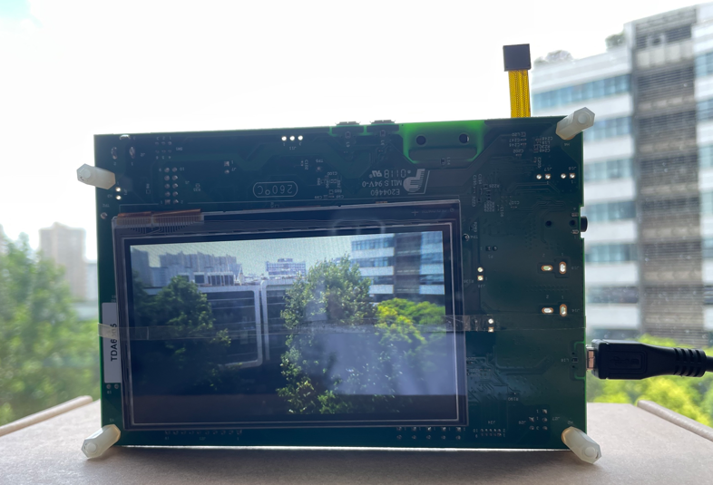

# NXP Application Code Hub
[](https://www.nxp.com)

## AN12110: Developing a Camera Application with i.MX RT Series
This application note describes how to develop an HD
camera application with the NXP i.MX RT1050 processor. 

For this demo application, the RT1050 receives video
frames from a camera device with resolution of HD-720
(1280x720 pixels, also called 720P), displays on an
LCD panel, and optionally saves to a microSD card with
compressed JPEG format. 

Please refer to [AN12110](https://www.nxp.com/docs/en/application-note/AN12110.pdf) for complete instructions on how to use this software. 


#### Boards: [EVK-MIMXRT1050](https://www.nxp.com/design/development-boards/i-mx-evaluation-and-development-boards/i-mx-rt1050-evaluation-kit:MIMXRT1050-EVK), [EVKB-IMXRT1050](https://www.nxp.com/design/development-boards/i-mx-evaluation-and-development-boards/i-mx-rt1050-evaluation-kit:MIMXRT1050-EVK)
#### Categories: Graphics, SDMMC, Vision
#### Peripherals: DISPLAY, SDMMC, VIDEO
#### Toolchains: IAR

## Table of Contents
1. [Software](#step1)
2. [Hardware](#step2)
3. [Setup](#step3)
4. [Results](#step4)
5. [FAQs](#step5) 
6. [Support](#step6)
7. [Release Notes](#step7)

## 1. Software<a name="step1"></a>
This demo is built based on NXP MCUXpresso SDK. All required source files to run the demo are contained in this repository.
- MCUXpresso SDK: 2.3.0
- SD MMC SDIO Card middleware: 2.2.2
- FatFs: 0.12c
- libjpeg: 9b
- IAR Embedded Workbench for ARM: 9.30.1

## 2. Hardware<a name="step2"></a>
- EVK-MIMXRT1050 Rev A or EVKB-IMXRT1050 Rev A/B boards
- MT9M114 camera module
- RK043FN02H-CT LCD module
- microSD card
- Personal Computer
- Micro USB cable

## 3. Setup<a name="step3"></a>
1. Connect the RK043FN02H-CT module to J8 of EVK-MIMXRT1050.
2. Connect the MT9M114 camera module to J35 of EVK-MIMXRT1050.
3. Insert the microSD card to the EVK SD card slot J20.
4. Connect a micro USB cable between the host PC and the OpenSDA USB port J28 on the EVK-MIMXRT1050 board. 
5. Open a serial terminal with the following settings:
    - 115200 baud rate
    - 8 data bits
    - No parity
    - One stop bit
    - No flow control
6. Build a configuration and download the program to the target board.

## 4. Results<a name="step4"></a>
When the demo runs successfully, the camera frames are shown in the LCD.
And the below log is shown in the serial terminal.
```
Camera demo starting...
```
You can touch the LCD panel with your finger, the current frame will be
compressed to JPEG format and stored in the microSD card.
And the the serial terminal shows:
```
Start of JPEG Compression... 
Done: xxx is saved. 
```



## 5. FAQs<a name="step5"></a>

## 6. Support<a name="step6"></a>
If you have questions, please create a ticket in NXP Community.

#### Project Metadata
<!----- Boards ----->
[](https://github.com/search?q=org%3Anxp-appcodehub+EVK-MIMXRT1050+in%3Areadme&type=Repositories) [](https://github.com/search?q=org%3Anxp-appcodehub+EVKB-IMXRT1050+in%3Areadme&type=Repositories)

<!----- Categories ----->
[](https://github.com/search?q=org%3Anxp-appcodehub+graphics+in%3Areadme&type=Repositories) [](https://github.com/search?q=org%3Anxp-appcodehub+sdmmc+in%3Areadme&type=Repositories) [](https://github.com/search?q=org%3Anxp-appcodehub+vision+in%3Areadme&type=Repositories)

<!----- Peripherals ----->
[](https://github.com/search?q=org%3Anxp-appcodehub+display+in%3Areadme&type=Repositories) [](https://github.com/search?q=org%3Anxp-appcodehub+sdmmc+in%3Areadme&type=Repositories) [](https://github.com/search?q=org%3Anxp-appcodehub+video+in%3Areadme&type=Repositories)

<!----- Toolchains ----->
[](https://github.com/search?q=org%3Anxp-appcodehub+iar+in%3Areadme&type=Repositories)

Questions regarding the content/correctness of this example can be entered as Issues within this GitHub repository.

>**Warning**: For more general technical questions regarding NXP Microcontrollers and the difference in expected funcionality, enter your questions on the [NXP Community Forum](https://community.nxp.com/)

[](https://www.youtube.com/@NXP_Semiconductors)
[](https://www.linkedin.com/company/nxp-semiconductors)
[](https://www.facebook.com/nxpsemi/)
[](https://twitter.com/NXP)

## 7. Release Notes<a name="step7"></a>
| Version | Description / Update                           | Date                        |
|:-------:|------------------------------------------------|----------------------------:|
| 1.0     | Initial release on Application Code Hub        | August 10<sup>th</sup> 2023 |

